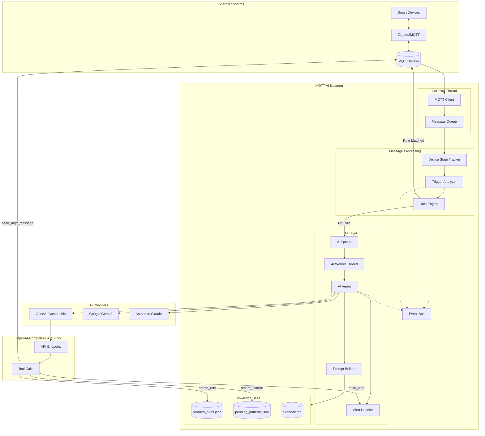
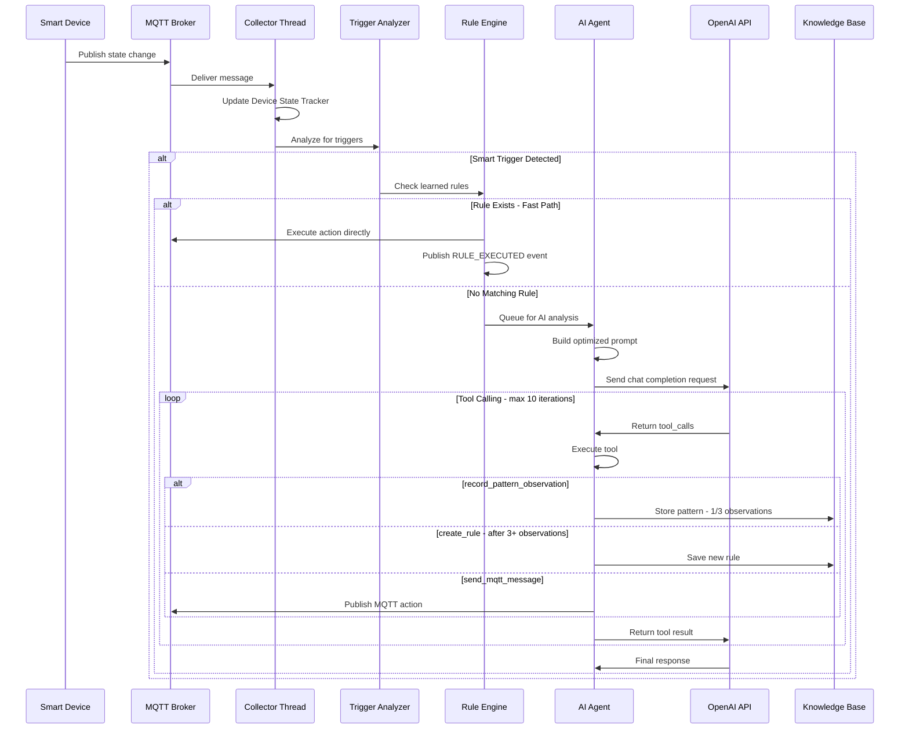
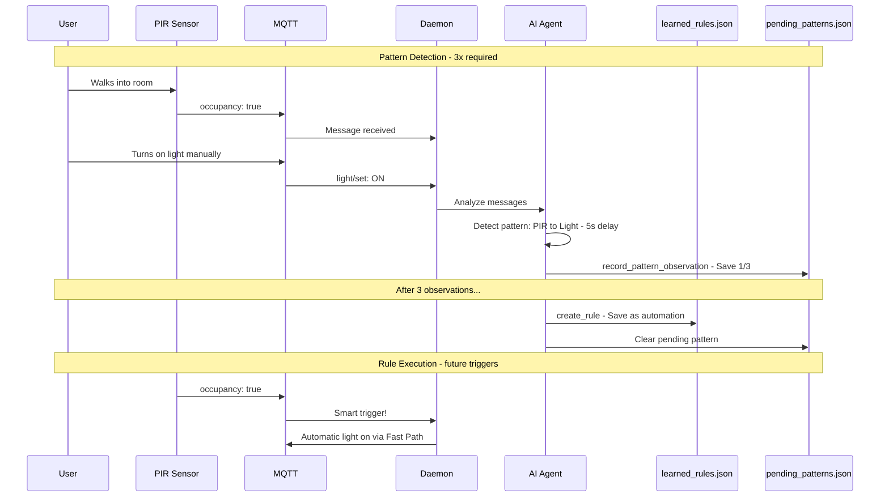
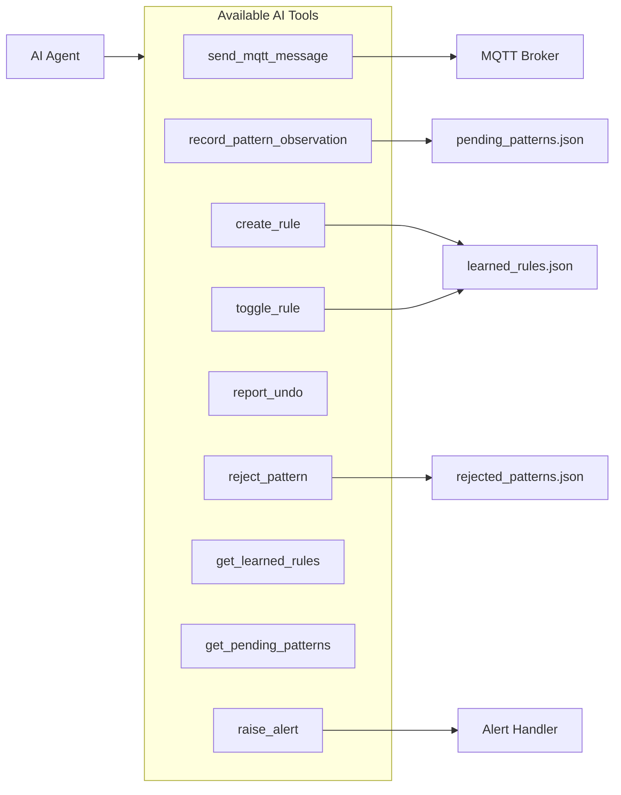
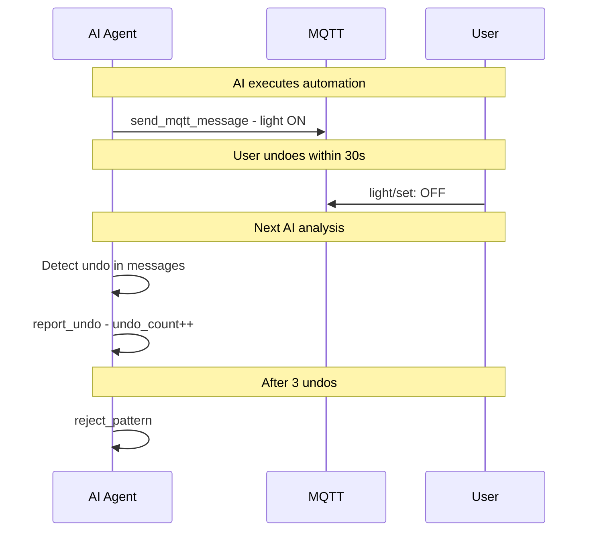

# MQTT2AI - Smart Home Automation with AI

MQTT2AI is an intelligent home automation daemon that connects AI agents to your smart home via MQTT. It monitors device messages, analyzes patterns, and enables AI to take autonomous actions—turning sensor events into intelligent responses.

## How It Works

The daemon sits between your MQTT broker (like Mosquitto with Zigbee2MQTT) and an AI provider. When a device publishes a state change, the system:

1. **Collects** messages and tracks device states in memory
2. **Analyzes** events to detect meaningful triggers (motion, door opens, button presses)
3. **Checks** for existing automation rules—if found, executes instantly (~100ms)
4. **Queries AI** for unrecognized patterns, allowing it to observe, learn, or act
5. **Learns** from repeated behaviors—after 3+ observations of the same pattern, creates a rule

The AI has access to tools for publishing MQTT commands, creating/managing rules, and raising security alerts. Rules execute on a fast path without AI involvement, keeping response times low.

## Features

- **AI Tool Calling** - AI agents can publish MQTT messages, create rules, and raise alerts
- **Fast Path Execution** - Learned rules execute instantly without AI latency
- **Smart Triggers** - Filters noise and only invokes AI on meaningful state changes
- **Multi-Provider Support** - Works with Gemini, Claude, and OpenAI-compatible APIs (Groq, Ollama, LM Studio)
- **Zigbee2MQTT Integration** - Built for Zigbee devices but works with any MQTT source
- **Simulation Mode** - Test scenarios with mock MQTT messages and assertions

---

## Security Warning

### Security Concerns

1. **No Input Validation**: MQTT messages from external sources are passed directly to the AI agent. Malicious actors with access to your MQTT broker might be able to craft messages that manipulate the AI into executing unintended actions. We're working on this.

---

## How It Works

1. **Message Collection**: The daemon subscribes to MQTT topics and collects messages from smart home devices.

2. **Trigger Detection**: The Trigger Analyzer detects meaningful state changes (e.g., motion detected, contact opened) while filtering noise.

3. **Fast Path Execution**: If a learned rule matches the trigger, the Rule Engine executes it immediately without AI involvement (~100ms response).

4. **AI Analysis**: For unrecognized patterns, messages are queued for AI analysis. The AI can:
   - Record pattern observations (needs 3+ observations before creating a rule)
   - Create automation rules from confirmed patterns
   - Execute immediate MQTT commands
   - Raise security alerts

5. **Pattern Learning**: The system learns from repeated user behaviors. After observing the same trigger→action pattern 3+ times, it creates an automation rule.

6. **Alert System**: Security-related events can trigger alerts with severity-based responses (logging, notifications, or AI-driven defensive actions).

---

## Command-Line Options

### MQTT Settings

| Parameter     | Default         | Description                         |
| ------------- | --------------- | ----------------------------------- |
| `--mqtt-host` | `192.168.1.245` | MQTT Broker Host (env: `MQTT_HOST`) |
| `--mqtt-port` | `1883`          | MQTT Broker Port (env: `MQTT_PORT`) |

### AI Provider Selection

| Parameter       | Default             | Description                                             |
| --------------- | ------------------- | ------------------------------------------------------- |
| `--ai-provider` | `openai-compatible` | AI provider: `gemini`, `claude`, or `openai-compatible` |

### Gemini (Google AI)

| Parameter          | Default            | Description                           |
| ------------------ | ------------------ | ------------------------------------- |
| `--gemini-model`   | `gemini-2.0-flash` | Gemini Model ID (env: `GEMINI_MODEL`) |
| `--gemini-api-key` | -                  | API key (env: `GEMINI_API_KEY`)       |

### Claude (Anthropic)

| Parameter          | Default                   | Description                           |
| ------------------ | ------------------------- | ------------------------------------- |
| `--claude-model`   | `claude-3-5-haiku-latest` | Claude Model ID (env: `CLAUDE_MODEL`) |
| `--claude-api-key` | -                         | API key (env: `ANTHROPIC_API_KEY`)    |

### OpenAI-Compatible API (Groq, Ollama, LM Studio, vLLM)

| Parameter           | Default                          | Description                                                 |
| ------------------- | -------------------------------- | ----------------------------------------------------------- |
| `--openai-api-base` | `https://api.groq.com/openai/v1` | Base URL for API (env: `OPENAI_API_BASE`)                   |
| `--openai-api-key`  | -                                | API key (env: `GROQ_API_KEY` or `OPENAI_API_KEY`)           |
| `--openai-models`   | `llama-3.3-70b-versatile`        | Comma-separated list for round-robin (env: `OPENAI_MODELS`) |

### Mode Flags

| Parameter                     | Short | Description                                                  |
| ----------------------------- | ----- | ------------------------------------------------------------ |
| `--verbose`                   | `-v`  | Enable verbose logging                                       |
| `--compress`                  | `-c`  | Compress MQTT payloads in console output                     |
| `--demo`                      | -     | Enable demo mode (limited tools)                             |
| `--no-ai`                     | -     | Disable AI calls (logging only)                              |
| `--test-ai`                   | -     | Test AI connection and exit                                  |
| `--disable-new-rules`         | -     | New rules are disabled by default (env: `DISABLE_NEW_RULES`) |
| `--disable-interval-trigger`  | -     | Disable time-based AI triggers                               |
| `--disable-threshold-trigger` | -     | Disable message count-based AI triggers                      |
| `--debug`                     | -     | Write HTTP call details to `debug-output/` directory         |

### Simulation & Testing

| Parameter                       | Description                                                      |
| ------------------------------- | ---------------------------------------------------------------- |
| `--simulation FILE`             | Run in simulation mode using a scenario JSON file                |
| `--simulation-speed MULTIPLIER` | Override speed multiplier (e.g., `10` = 10x faster)              |
| `--test`                        | Validate assertions from scenario and exit with pass/fail status |
| `--report FILE`                 | Write JSON test report to file (requires `--test`)               |

---

## Usage Examples

### Basic Usage

```bash
# Start with default settings (Groq API)
python mqtt_ai_daemon.py

# Use with verbose logging
python mqtt_ai_daemon.py -v

# Use Claude as AI provider
python mqtt_ai_daemon.py --ai-provider claude --claude-api-key YOUR_KEY
```

### Testing AI Connection

```bash
# Test that AI connection works before starting
python mqtt_ai_daemon.py --test-ai
```

### Using Different AI Providers

```bash
# Groq (default, blazing fast)
export GROQ_API_KEY="your-groq-key"
python mqtt_ai_daemon.py --ai-provider openai-compatible

# Google Gemini
export GEMINI_API_KEY="your-gemini-key"
python mqtt_ai_daemon.py --ai-provider gemini

# Anthropic Claude
export ANTHROPIC_API_KEY="your-anthropic-key"
python mqtt_ai_daemon.py --ai-provider claude

# Local Ollama
python mqtt_ai_daemon.py \
    --ai-provider openai-compatible \
    --openai-api-base http://localhost:11434/v1 \
    --openai-models llama3.2
```

### Simulation Mode

```bash
# Run a simulation scenario
python mqtt_ai_daemon.py --simulation scenarios/motion_light.json

# Run with speed multiplier
python mqtt_ai_daemon.py --simulation scenarios/test.json --simulation-speed 10

# Run tests with assertions
python mqtt_ai_daemon.py \
    --simulation scenarios/test.json \
    --test \
    --report test-results.json
```

### Production Configuration

```bash
# Typical production setup
python mqtt_ai_daemon.py \
    --mqtt-host 192.168.1.100 \
    --ai-provider openai-compatible \
    --compress \
    --disable-new-rules
```

---

## Environment Variables

| Variable            | Description                                   |
| ------------------- | --------------------------------------------- |
| `MQTT_HOST`         | MQTT broker hostname                          |
| `MQTT_PORT`         | MQTT broker port                              |
| `AI_PROVIDER`       | AI provider to use                            |
| `GROQ_API_KEY`      | API key for Groq                              |
| `OPENAI_API_KEY`    | API key for OpenAI-compatible APIs            |
| `OPENAI_API_BASE`   | Base URL for OpenAI-compatible API            |
| `OPENAI_MODELS`     | Comma-separated model list                    |
| `GEMINI_API_KEY`    | API key for Google Gemini                     |
| `ANTHROPIC_API_KEY` | API key for Anthropic Claude                  |
| `DISABLE_NEW_RULES` | Set to `true` to disable new rules by default |

---

## Key Files

| File                     | Description                                           |
| ------------------------ | ----------------------------------------------------- |
| `learned_rules.json`     | Active automation rules (trigger → action mappings)   |
| `pending_patterns.json`  | Pattern observations awaiting rule creation           |
| `rejected_patterns.json` | Patterns marked as coincidental (won't become rules)  |
| `rulebook.md`            | Decision rules and guidelines passed to AI as context |
| `filtered_triggers.json` | Configuration for trigger filtering                   |

---

## Decision Rules (Rulebook)

The `rulebook.md` defines how the AI should respond to events:

### 1. Security Alerts
When security is `armed_home` or `armed_away`:
- Door/window opened → Activate siren + send notification
- Motion detected → Activate siren + send notification

### 2. Safety Emergencies (Always Respond)
- Smoke detected → High alarm + critical notification
- Water leak → High alarm + critical notification
- Temperature > 50°C → High alarm + critical notification

### 3. Power Anomalies
- Power spike/drop > 500W → Send alert to `alert/power`

### 4. Pattern Learning
- Detect trigger→action sequences (sensor event followed by user action)
- Record observations (3 required to create rule)
- Formalize into automation rules

### Noise Filtering
The AI ignores minor fluctuations:
- `linkquality` changes
- `voltage` variations < 10V
- `current` variations < 0.5A
- `power` readings < 5W
- `temperature` changes < 1°C
- `humidity` changes < 5%

---

## Example Learned Rule

```json
{
  "id": "pir_hallway_to_light_kitchen",
  "trigger": {
    "topic": "zigbee2mqtt/pir_hallway",
    "field": "occupancy",
    "value": true
  },
  "action": {
    "topic": "zigbee2mqtt/light_kitchen/set",
    "payload": "{\"state\": \"ON\"}"
  },
  "timing": {
    "avg_delay_seconds": 5.0,
    "tolerance_seconds": 2.0
  },
  "confidence": {
    "occurrences": 3,
    "last_triggered": "2025-12-20T10:30:00"
  },
  "enabled": true
}
```

---

## Architecture



---

## Message Flow



---

## Pattern Learning Flow



---

## Tool System



---

## Undo Detection and Rejected Patterns

The system can detect when users don't want a particular automation and automatically reject it.

### How Undo Detection Works

When the AI executes a learned rule, the action appears in the MQTT message buffer. If the user "undoes" the action within ~30 seconds (e.g., turns OFF a light that was just auto-turned ON), the AI detects this pattern:



### Rejected Patterns

Patterns can be rejected in two ways:

1. **Automatic**: After 3 user undos, the AI calls `reject_pattern()` 
2. **Manual**: Directly add to `rejected_patterns.json` or call `reject_pattern()` tool

Rejected patterns will:
- Never be tracked as pending patterns
- Never be created as new rules
- Have any existing rules automatically deleted

### Example Rejected Pattern

```json
{
  "patterns": [
    {
      "trigger_topic": "zigbee2mqtt/pir_ground_floor",
      "trigger_field": "occupancy",
      "action_topic": "zigbee2mqtt/light_first_floor/set",
      "reason": "User undid automation 3 times - coincidental pattern",
      "rejected_at": "2025-12-20T21:00:00"
    }
  ]
}
```

---

## License

MIT License
