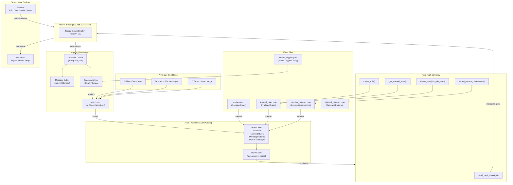
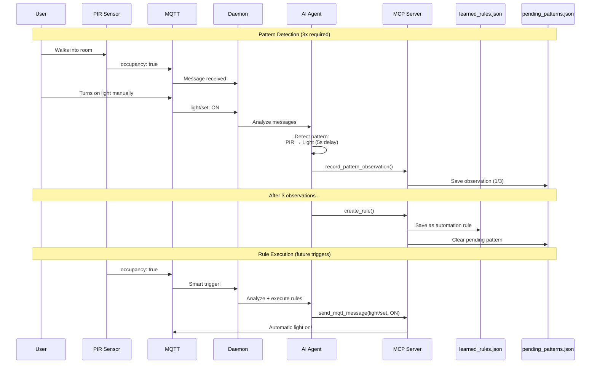
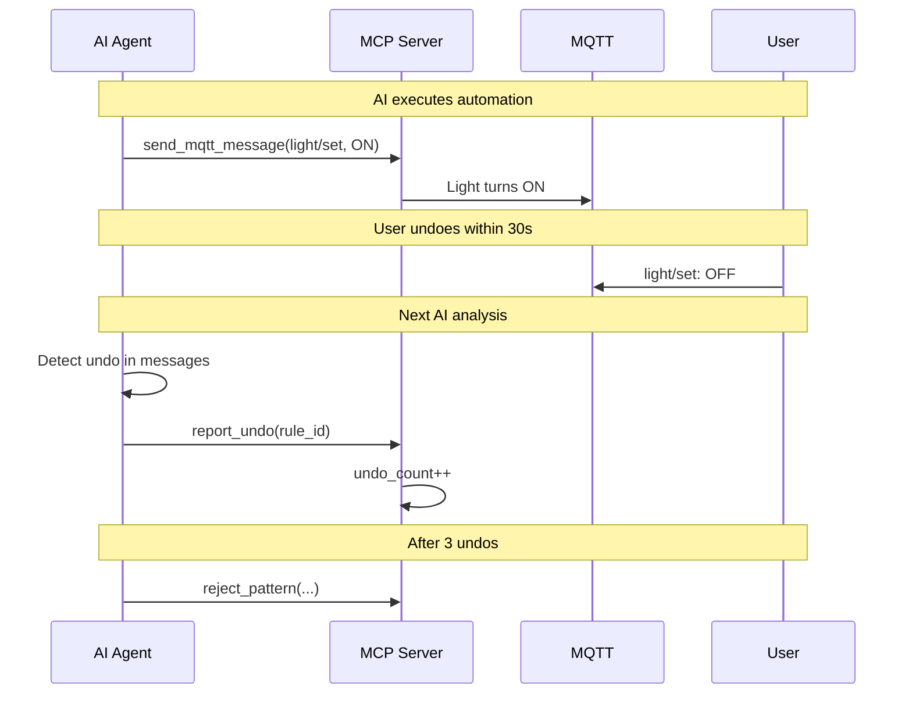

# MQTT2AI Home Automation Daemon

A self-learning smart home automation system that uses AI to analyze MQTT messages, detect user behavior patterns, and automatically create automation rules.

## Features

- 🤖 **AI-Powered Analysis** - Supports multiple AI providers (Gemini, Claude, Codex/OpenAI)
- 📚 **Pattern Learning** - Watches user behavior and learns automation rules
- ⚡ **Smart Triggers** - Filters noise and only triggers AI on significant events
- 🔧 **MCP Tool Calling** - AI can directly publish MQTT messages and manage rules
- 🏠 **Zigbee2MQTT Integration** - Works with Zigbee devices via MQTT
- 🚫 **Undo Detection** - Automatically detects and rejects unwanted automations

---

## ⚠️ Security Warning

> **This system runs AI agents in UNSAFE/AUTO-APPROVE mode with no human confirmation required.**

### Security Concerns

1. **No Input Validation**: MQTT messages from external sources are passed directly to the AI agent. Malicious actors with access to your MQTT broker might be able to craft messages that manipulate the AI into executing unintended actions. We're working on this.

---

## Architecture



---

## How It Works

### 1. Message Collection

The daemon runs a **collector thread** that subscribes to all MQTT topics (`#`). Messages are:
- Stored in a circular buffer (max 1000 messages)
- Filtered through `TriggerAnalyzer` to detect significant state changes
- Timestamped for pattern delay calculation

### 2. AI Trigger Conditions

The AI analysis runs when ANY of these conditions are met:

| Trigger | Threshold | Description |
|---------|-----------|-------------|
| ⏰ Time | 300 seconds | Periodic analysis every 5 minutes |
| 📊 Count | 50 messages | After accumulating 50 new messages |
| 🎯 Smart | State change | When TriggerAnalyzer detects significant change |

### 3. AI Orchestration

When triggered, the daemon builds a prompt containing:
- The **rulebook** (decision rules from `rulebook.md`)
- **Learned rules** (confirmed automations from `learned_rules.json`)
- **Pending patterns** (observations not yet rules from `pending_patterns.json`)
- **Recent MQTT messages** (with timestamps)

The AI is invoked via the configured CLI (Gemini, Claude, or Codex) with MCP tool calling enabled and auto-approval mode.

### 4. MCP Tools

The AI can call these tools via the MCP server:

| Tool | Purpose |
|------|---------|
| `send_mqtt_message(topic, payload)` | Publish to MQTT topics |
| `record_pattern_observation(...)` | Track trigger→action sequences |
| `create_rule(...)` | Formalize a pattern into a rule (after 3 observations) |
| `get_learned_rules()` | Retrieve active automation rules |
| `get_pending_patterns()` | Check observation counts |
| `delete_rule(rule_id)` | Remove a learned rule |
| `toggle_rule(rule_id, enabled)` | Enable/disable a rule |
| `clear_pending_patterns()` | Reset pattern learning |
| `report_undo(rule_id)` | Report user undid an automated action |
| `reject_pattern(...)` | Permanently reject a pattern |
| `get_rejected_patterns()` | List rejected patterns |
| `remove_rejected_pattern(...)` | Allow a rejected pattern to be learned again |

---

## Pattern Learning Flow



---

## Undo Detection and Rejected Patterns

The system can detect when users don't want a particular automation and automatically reject it.

### How Undo Detection Works

When the AI executes a learned rule, the action appears in the MQTT message buffer. If the user "undoes" the action within ~30 seconds (e.g., turns OFF a light that was just auto-turned ON), the AI detects this pattern:



### Rejected Patterns

Patterns can be rejected in two ways:

1. **Automatic**: After 3 user undos, the AI calls `reject_pattern()` 
2. **Manual**: Directly add to `rejected_patterns.json` or call `reject_pattern()` tool

Rejected patterns will:
- Never be tracked as pending patterns
- Never be created as new rules
- Have any existing rules automatically deleted

### Example Rejected Pattern

```json
{
  "patterns": [
    {
      "trigger_topic": "zigbee2mqtt/pir_ground_floor",
      "trigger_field": "occupancy",
      "action_topic": "zigbee2mqtt/light_first_floor/set",
      "reason": "User undid automation 3 times - coincidental pattern",
      "rejected_at": "2025-12-20T21:00:00"
    }
  ]
}
```

---

## Decision Rules (Rulebook)

The `rulebook.md` defines how the AI should respond to events:

### 1. Security Alerts
When security is `armed_home` or `armed_away`:
- Door/window opened → Activate siren + send notification
- Motion detected → Activate siren + send notification

### 2. Safety Emergencies (Always Respond)
- Smoke detected → High alarm + critical notification
- Water leak → High alarm + critical notification
- Temperature > 50°C → High alarm + critical notification

### 3. Power Anomalies
- Power spike/drop > 500W → Send alert to `alert/power`

### 4. Pattern Learning
- Detect trigger→action sequences (sensor event followed by user action)
- Record observations (3 required to create rule)
- Formalize into automation rules

### Noise Filtering
The AI ignores minor fluctuations:
- `linkquality` changes
- `voltage` variations < 10V
- `current` variations < 0.5A
- `power` readings < 5W
- `temperature` changes < 1°C
- `humidity` changes < 5%

---

## File Structure

```
mqtt-fun/
├── mqtt_ai_daemon.py       # Main daemon (collector + AI orchestration)
├── mcp_mqtt_server.py      # MCP server exposing MQTT tools to AI
├── trigger_analyzer.py     # Smart filtering for significant events
├── rulebook.md             # Decision rules for the AI
├── learned_rules.json      # Confirmed automation rules
├── pending_patterns.json   # Pattern observations (not yet rules)
├── rejected_patterns.json  # Patterns that should never be learned
├── filtered_triggers.json  # Smart trigger configuration
├── instant_triggers.json   # Instant trigger rules
├── mqtt_listener.py        # Simple MQTT listener utility
├── mqtt_spawn_test_client.py # Test client for simulating devices
└── send_alerts.py          # Alert sending utility
```

---

## Configuration

Configuration is managed via command-line arguments or environment variables.

### General Options

| Argument | Env Variable | Default | Description |
|----------|--------------|---------|-------------|
| `--mqtt-host` | `MQTT_HOST` | `192.168.1.245` | MQTT broker address |
| `--mqtt-port` | `MQTT_PORT` | `1883` | MQTT broker port |
| `--ai-provider` | `AI_PROVIDER` | `gemini` | AI provider: `gemini`, `claude`, or `codex-openai` |
| `--verbose`, `-v` | - | `False` | Enable verbose logging |
| `--demo` | - | `False` | Enable demo mode |
| `--no-ai` | - | `False` | Disable AI calls (logging only mode) |

### Gemini Options

| Argument           | Env Variable         | Default                    | Description         |
| ------------------ | -------------------- | -------------------------- | ------------------- |
| `--gemini-command` | `GEMINI_CLI_COMMAND` | `/opt/homebrew/bin/gemini` | Path to Gemini CLI  |
| `--gemini-model`   | -                    | `gemini-2.5-flash`         | Gemini model to use |

### Claude Options

| Argument              | Env Variable         | Default                   | Description                  |
| --------------------- | -------------------- | ------------------------- | ---------------------------- |
| `--claude-command`    | `CLAUDE_CLI_COMMAND` | `~/.nvm/.../bin/claude`   | Path to Claude CLI           |
| `--claude-model`      | -                    | `claude-3-5-haiku-latest` | Claude model to use          |
| `--claude-mcp-config` | `CLAUDE_MCP_CONFIG`  | -                         | Path to MCP config JSON file |

### Codex/OpenAI Options

| Argument          | Env Variable        | Default   | Description               |
| ----------------- | ------------------- | --------- | ------------------------- |
| `--codex-command` | `CODEX_CLI_COMMAND` | `codex`   | Path to Codex CLI         |
| `--codex-model`   | -                   | `o4-mini` | Codex/OpenAI model to use |

**Note:** Codex requires an OpenAI API key. Set it via environment variable:

```bash
export OPENAI_API_KEY="your-api-key-here"
```

Or authenticate interactively by running `codex` once (supports ChatGPT Plus/Pro/Business accounts).

---

## Requirements

- Python 3.8+
- `mosquitto_sub` and `mosquitto_pub` (mosquitto-clients)
- At least one AI CLI tool:
  - Gemini CLI (`/opt/homebrew/bin/gemini`)
  - Claude CLI (`npm i -g @anthropic-ai/claude-code`)
  - Codex CLI (`npm i -g @openai/codex`)
- MCP Python library (`mcp`)

### Installation

```bash
# Install mosquitto clients
brew install mosquitto  # macOS
# or
apt install mosquitto-clients  # Linux

# Install Python dependencies
pip install mcp

# Install AI CLI tools (choose one or more)
# Gemini - follow Google's Gemini CLI documentation
# Claude
npm i -g @anthropic-ai/claude-code
# Codex/OpenAI
npm i -g @openai/codex
```

---

## MCP Server Configuration

The MCP server (`mcp_mqtt_server.py`) exposes MQTT tools to the AI. Each AI provider has its own way of registering MCP servers.

### Gemini MCP Configuration

Gemini looks for MCP servers in `~/.gemini/settings.json`. Add the mqtt-tools server:

```json
{
  "mcpServers": {
    "mqtt-tools": {
      "command": "python3",
      "args": ["/path/to/mqtt2ai/mcp_mqtt_server.py"],
      "cwd": "/path/to/mqtt2ai"
    }
  }
}
```

The daemon uses `--allowed-mcp-server-names mqtt-tools` to enable this server.

### Claude MCP Configuration

Claude uses a JSON config file. Create `~/.config/claude/mcp.json`:

```json
{
  "mcpServers": {
    "mqtt-tools": {
      "command": "python3",
      "args": ["/path/to/mqtt2ai/mcp_mqtt_server.py"]
    }
  }
}
```

Then run the daemon with:

```bash
python mqtt_ai_daemon.py --ai-provider claude --claude-mcp-config ~/.config/claude/mcp.json
```

### Codex/OpenAI MCP Configuration

Codex uses a TOML config file at `~/.codex/config.toml`. Add:

```toml
[mcp_servers.mqtt-tools]
command = "python3"
args = ["/path/to/mqtt2ai/mcp_mqtt_server.py"]
```

The daemon will automatically use MCP servers configured in this file.

---

## Usage

### Run the Daemon

```bash
# With Gemini (default)
python3 mqtt_ai_daemon.py

# With Claude
python3 mqtt_ai_daemon.py --ai-provider claude --claude-mcp-config ~/.config/claude/mcp.json

# With Codex/OpenAI
python3 mqtt_ai_daemon.py --ai-provider codex-openai

# Verbose mode (print all messages)
python3 mqtt_ai_daemon.py --verbose

# No-AI mode (logging only, for testing triggers)
python3 mqtt_ai_daemon.py --no-ai -v

# Custom MQTT host
python3 mqtt_ai_daemon.py --mqtt-host 192.168.1.50

# Show all options
python3 mqtt_ai_daemon.py --help
```

### Test with Simulated Devices

```bash
python mqtt_spawn_test_client.py
```

---

## Example Learned Rule

```json
{
  "id": "pir_hallway_to_light_kitchen",
  "trigger": {
    "topic": "zigbee2mqtt/pir_hallway",
    "field": "occupancy",
    "value": true
  },
  "action": {
    "topic": "zigbee2mqtt/light_kitchen/set",
    "payload": "{\"state\": \"ON\"}"
  },
  "timing": {
    "avg_delay_seconds": 5.0,
    "tolerance_seconds": 2.0
  },
  "confidence": {
    "occurrences": 3,
    "last_triggered": "2025-12-20T10:30:00"
  },
  "enabled": true
}
```

---

## License

MIT License

