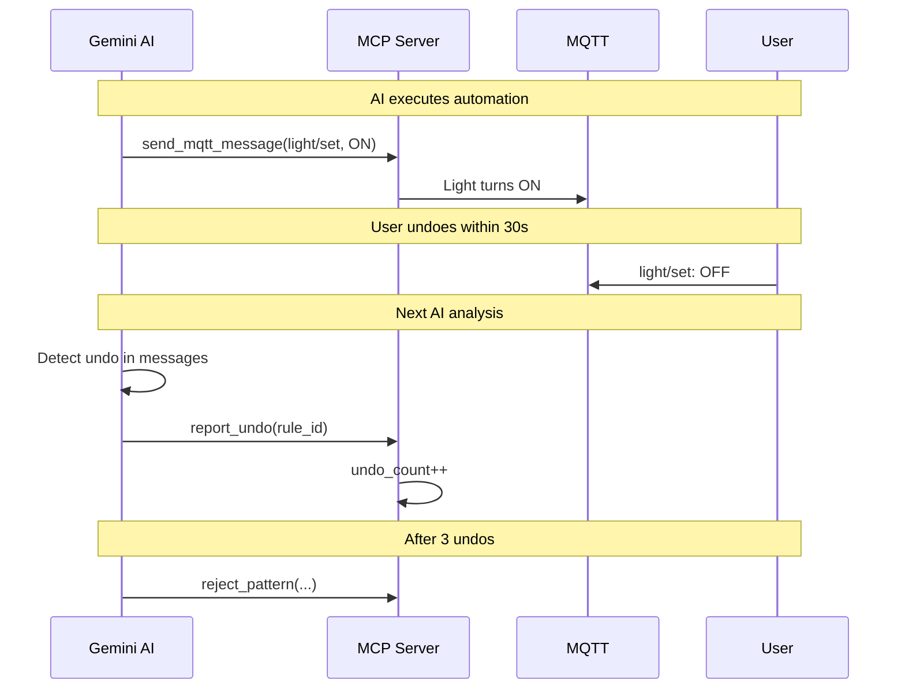

# MQTT2AI Home Automation Daemon

A self-learning smart home automation system that uses AI (Gemini) to analyze MQTT messages, detect user behavior patterns, and automatically create automation rules.

## Features

- 🤖 **AI-Powered Analysis** - Uses Gemini CLI to understand MQTT events
- 📚 **Pattern Learning** - Watches user behavior and learns automation rules
- ⚡ **Smart Triggers** - Filters noise and only triggers AI on significant events
- 🔧 **MCP Tool Calling** - AI can directly publish MQTT messages and manage rules
- 🏠 **Zigbee2MQTT Integration** - Works with Zigbee devices via MQTT
- 🚫 **Undo Detection** - Automatically detects and rejects unwanted automations

---

## Architecture

```mermaid
flowchart TB
    subgraph MQTT["MQTT Broker (192.168.1.245:1883)"]
        Topics["Topics: zigbee2mqtt/#, home/#, etc."]
    end

    subgraph Daemon["mqtt_ai_daemon.py"]
        Collector["Collector Thread<br/>(mosquitto_sub)"]
        MessageDeque["Message Buffer<br/>(max 1000 msgs)"]
        TriggerAnalyzer["TriggerAnalyzer<br/>(Smart Filtering)"]
        AILoop["Main Loop<br/>(AI Check Scheduler)"]
    end

    subgraph Triggers["AI Trigger Conditions"]
        T1["⏰ Time: Every 300s"]
        T2["📊 Count: 50+ messages"]
        T3["🎯 Smart: State change"]
    end

    subgraph GeminiAI["Gemini CLI"]
        Prompt["Prompt with:<br/>- Rulebook<br/>- Learned Rules<br/>- Pending Patterns<br/>- MQTT Messages"]
        MCPClient["MCP Client<br/>(--yolo mode)"]
    end

    subgraph MCPServer["mcp_mqtt_server.py"]
        direction TB
        Tool1["send_mqtt_message()"]
        Tool2["record_pattern_observation()"]
        Tool3["create_rule()"]
        Tool4["get_learned_rules()"]
        Tool5["delete_rule() / toggle_rule()"]
    end

    subgraph Storage["JSON Files"]
        RulebookMD["rulebook.md<br/>(Decision Rules)"]
        LearnedRules["learned_rules.json<br/>(Finalized Rules)"]
        PendingPatterns["pending_patterns.json<br/>(Pattern Observations)"]
        RejectedPatterns["rejected_patterns.json<br/>(Rejected Patterns)"]
        FilteredTriggers["filtered_triggers.json<br/>(Smart Trigger Config)"]
    end

    subgraph Devices["Smart Home Devices"]
        Sensors["Sensors:<br/>PIR, Door, Smoke, Water"]
        Actuators["Actuators:<br/>Lights, Sirens, Plugs"]
    end

    %% Data Flow
    Sensors -->|"publish events"| MQTT
    MQTT -->|"subscribe #"| Collector
    Collector --> MessageDeque
    Collector --> TriggerAnalyzer
    TriggerAnalyzer -->|"triggers"| AILoop
    
    T1 --> AILoop
    T2 --> AILoop
    T3 --> AILoop

    AILoop -->|"invoke"| Prompt
    RulebookMD -->|"context"| Prompt
    LearnedRules -->|"context"| Prompt
    PendingPatterns -->|"context"| Prompt
    
    Prompt --> MCPClient
    MCPClient -->|"tool calls"| MCPServer
    
    Tool1 -->|"mosquitto_pub"| MQTT
    Tool2 --> PendingPatterns
    Tool3 --> LearnedRules
    Tool4 --> LearnedRules
    Tool5 --> LearnedRules

    MQTT -->|"commands"| Actuators
    FilteredTriggers --> TriggerAnalyzer
```



---

## How It Works

### 1. Message Collection

The daemon runs a **collector thread** that subscribes to all MQTT topics (`#`). Messages are:
- Stored in a circular buffer (max 1000 messages)
- Filtered through `TriggerAnalyzer` to detect significant state changes
- Timestamped for pattern delay calculation

### 2. AI Trigger Conditions

The AI analysis runs when ANY of these conditions are met:

| Trigger | Threshold | Description |
|---------|-----------|-------------|
| ⏰ Time | 300 seconds | Periodic analysis every 5 minutes |
| 📊 Count | 50 messages | After accumulating 50 new messages |
| 🎯 Smart | State change | When TriggerAnalyzer detects significant change |

### 3. AI Orchestration

When triggered, the daemon builds a prompt containing:
- The **rulebook** (decision rules from `rulebook.md`)
- **Learned rules** (confirmed automations from `learned_rules.json`)
- **Pending patterns** (observations not yet rules from `pending_patterns.json`)
- **Recent MQTT messages** (with timestamps)

The AI is invoked via Gemini CLI with MCP tool calling enabled (`--yolo` mode for auto-approval).

### 4. MCP Tools

The AI can call these tools via the MCP server:

| Tool | Purpose |
|------|---------|
| `send_mqtt_message(topic, payload)` | Publish to MQTT topics |
| `record_pattern_observation(...)` | Track trigger→action sequences |
| `create_rule(...)` | Formalize a pattern into a rule (after 3 observations) |
| `get_learned_rules()` | Retrieve active automation rules |
| `get_pending_patterns()` | Check observation counts |
| `delete_rule(rule_id)` | Remove a learned rule |
| `toggle_rule(rule_id, enabled)` | Enable/disable a rule |
| `clear_pending_patterns()` | Reset pattern learning |
| `report_undo(rule_id)` | Report user undid an automated action |
| `reject_pattern(...)` | Permanently reject a pattern |
| `get_rejected_patterns()` | List rejected patterns |
| `remove_rejected_pattern(...)` | Allow a rejected pattern to be learned again |

---

## Pattern Learning Flow


---

## Undo Detection and Rejected Patterns

The system can detect when users don't want a particular automation and automatically reject it.

### How Undo Detection Works

When the AI executes a learned rule, the action appears in the MQTT message buffer. If the user "undoes" the action within ~30 seconds (e.g., turns OFF a light that was just auto-turned ON), the AI detects this pattern:



### Rejected Patterns

Patterns can be rejected in two ways:

1. **Automatic**: After 3 user undos, the AI calls `reject_pattern()` 
2. **Manual**: Directly add to `rejected_patterns.json` or call `reject_pattern()` tool

Rejected patterns will:
- Never be tracked as pending patterns
- Never be created as new rules
- Have any existing rules automatically deleted

### Example Rejected Pattern

```json
{
  "patterns": [
    {
      "trigger_topic": "zigbee2mqtt/pir_ground_floor",
      "trigger_field": "occupancy",
      "action_topic": "zigbee2mqtt/light_first_floor/set",
      "reason": "User undid automation 3 times - coincidental pattern",
      "rejected_at": "2025-12-20T21:00:00"
    }
  ]
}
```

---

## Decision Rules (Rulebook)

The `rulebook.md` defines how the AI should respond to events:

### 1. Security Alerts
When security is `armed_home` or `armed_away`:
- Door/window opened → Activate siren + send notification
- Motion detected → Activate siren + send notification

### 2. Safety Emergencies (Always Respond)
- Smoke detected → High alarm + critical notification
- Water leak → High alarm + critical notification
- Temperature > 50°C → High alarm + critical notification

### 3. Power Anomalies
- Power spike/drop > 500W → Send alert to `alert/power`

### 4. Pattern Learning
- Detect trigger→action sequences (sensor event followed by user action)
- Record observations (3 required to create rule)
- Formalize into automation rules

### Noise Filtering
The AI ignores minor fluctuations:
- `linkquality` changes
- `voltage` variations < 10V
- `current` variations < 0.5A
- `power` readings < 5W
- `temperature` changes < 1°C
- `humidity` changes < 5%

---

## File Structure

```
mqtt-fun/
├── mqtt_ai_daemon.py       # Main daemon (collector + AI orchestration)
├── mcp_mqtt_server.py      # MCP server exposing MQTT tools to AI
├── trigger_analyzer.py     # Smart filtering for significant events
├── rulebook.md             # Decision rules for the AI
├── learned_rules.json      # Confirmed automation rules
├── pending_patterns.json   # Pattern observations (not yet rules)
├── rejected_patterns.json  # Patterns that should never be learned
├── filtered_triggers.json  # Smart trigger configuration
├── instant_triggers.json   # Instant trigger rules
├── mqtt_listener.py        # Simple MQTT listener utility
├── mqtt_spawn_test_client.py # Test client for simulating devices
└── send_alerts.py          # Alert sending utility
```

---

## Configuration

Key settings in `mqtt_ai_daemon.py`:

| Setting | Default | Description |
|---------|---------|-------------|
| `MQTT_HOST` | `192.168.1.245` | MQTT broker address |
| `MQTT_PORT` | `1883` | MQTT broker port |
| `MQTT_TOPIC` | `#` | Topics to subscribe to |
| `MAX_MESSAGES` | `1000` | Message buffer size |
| `AI_CHECK_INTERVAL_SECONDS` | `300` | Periodic AI check interval |
| `AI_CHECK_MESSAGE_THRESHOLD` | `50` | Messages before AI check |
| `GEMINI_MODEL` | `gemini-2.5-flash` | AI model to use |
| `DEMO_MODE` | `False` | Enable demo mode (always publishes jokes) |

---

## Requirements

- Python 3.8+
- `mosquitto_sub` and `mosquitto_pub` (mosquitto-clients)
- Gemini CLI (`/opt/homebrew/bin/gemini`)
- MCP Python library (`mcp`)

### Installation

```bash
# Install mosquitto clients
brew install mosquitto  # macOS
# or
apt install mosquitto-clients  # Linux

# Install Python dependencies
pip install mcp

# Install Gemini CLI (follow Gemini documentation)
```

---

## Usage

### Start the MCP Server

The MCP server must be configured in your Gemini CLI settings. Add to your MCP configuration:

```json
{
  "mcpServers": {
    "mqtt-tools": {
      "command": "python",
      "args": ["mcp_mqtt_server.py"],
      "cwd": "/path/to/mqtt-fun"
    }
  }
}
```

### Run the Daemon

```bash
# Normal mode
python mqtt_ai_daemon.py

# Verbose mode (print all messages)
python mqtt_ai_daemon.py --verbose
```

### Test with Simulated Devices

```bash
python mqtt_spawn_test_client.py
```

---

## Example Learned Rule

```json
{
  "id": "pir_hallway_to_light_kitchen",
  "trigger": {
    "topic": "zigbee2mqtt/pir_hallway",
    "field": "occupancy",
    "value": true
  },
  "action": {
    "topic": "zigbee2mqtt/light_kitchen/set",
    "payload": "{\"state\": \"ON\"}"
  },
  "timing": {
    "avg_delay_seconds": 5.0,
    "tolerance_seconds": 2.0
  },
  "confidence": {
    "occurrences": 3,
    "last_triggered": "2025-12-20T10:30:00"
  },
  "enabled": true
}
```

---

## License

MIT License

